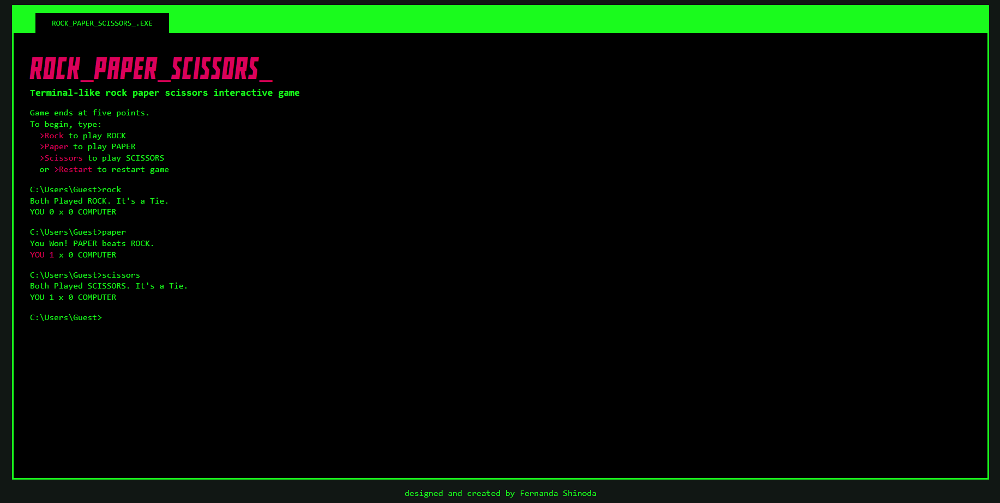

# odin-rock-paper-scissors
This is a Rock Paper Scissors project from [The Odin Project](https://www.theodinproject.com/lessons/foundations-rock-paper-scissors) designed to exercise programming mindset (planning, separating a macro problem in micro problemns, pseudocoding and solving the problem) and basic JavaScript. It is built to play against the computer.

Pretty simple but a good exercise.

Thanks again, The Odin Project :heart:
